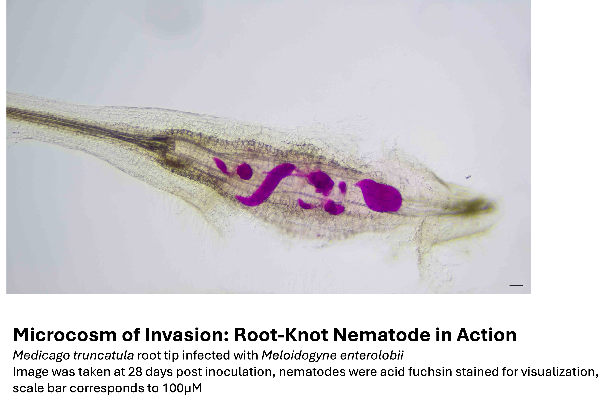

If you know me, you know I love looking at nematodes under the dissecting scope; even more so when you get lucky with multiple lifestages in a single root tip! Delighted that the selection committee for the NemArt competition by the Italian Society of Nematology shared this sentiment and awarded this photo a special prize!

---

Thanks for reading — and feel free to reach out at us275(at)cam.ac.uk if you’d like to chat about the image or the science behind it.